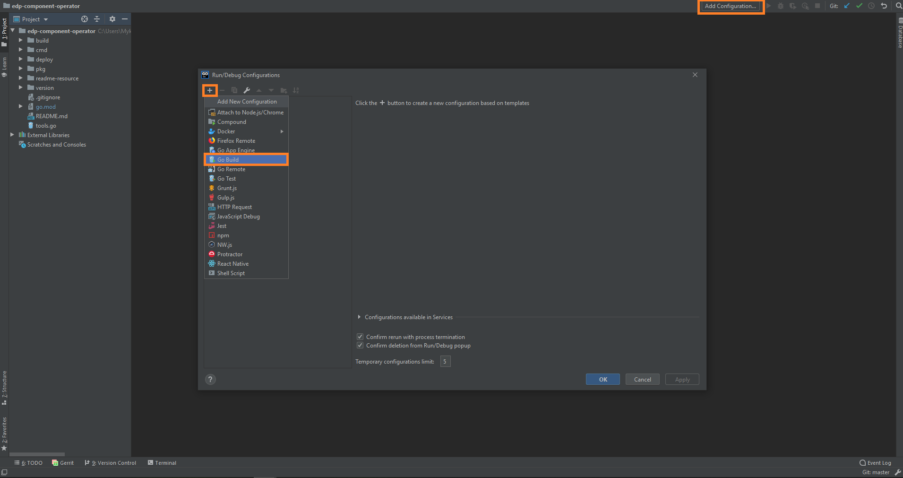
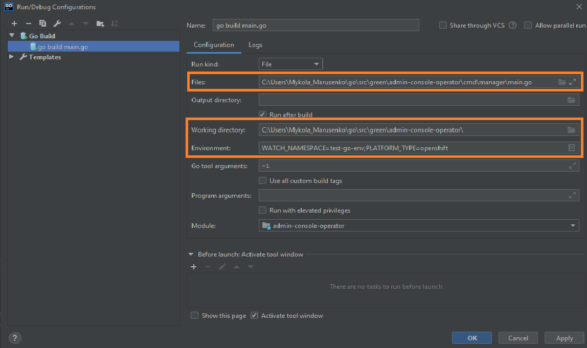
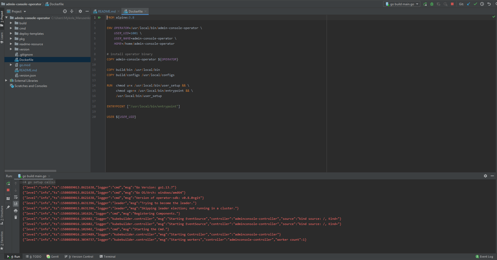

# Local Development

## Requirements:
* Go version (great than 1.13)
  
_**NOTE**: Make sure that environment variable GOPATH and GOROOT are added in PATH:_
```
export GOPATH=C:\Users\<<username>>\go
export GOROOT=C:\Go
```
  
* PostgreSQL client (great than 9.5 version)
* Configured access to the VCS (see [Gerrit Setup for Developer](https://kb.epam.com/display/EPMDEDP/Gerrit+Setup+for+Developer))
* GoLand Intellij Idea or another IDE
  
## Running the operator:
1. Clone repository
2. Open folder in GoLand Intellij Idea and select Add Configuration → Go Build
   
3. Set the path to the main.go file in Files field, path to the Working directory for operator and set Specify a platform name (OpenShift/Kubernetes) and selected namespace in Environment tab
   
4. Run 'go build main.go' (Shift+F10)
   
  
5. Check the operator logs in output console
 ```
{"level":"info","ts":1580888557.7898252,"logger":"cmd","msg":"Go Version: go1.13.7"}
{"level":"info","ts":1580888557.7898252,"logger":"cmd","msg":"Go OS/Arch: windows/amd64"}
{"level":"info","ts":1580888557.7898252,"logger":"cmd","msg":"Version of operator-sdk: v0.8.0+git"}
{"level":"info","ts":1580888557.7917771,"logger":"leader","msg":"Trying to become the leader."}
{"level":"info","ts":1580888557.7917771,"logger":"leader","msg":"Skipping leader election; not running in a cluster."}
{"level":"info","ts":1580888559.959313,"logger":"cmd","msg":"Registering Components."}
{"level":"info","ts":1580888559.9612925,"logger":"kubebuilder.controller","msg":"Starting EventSource","controller":"adminconsole-controller","source":"kind source: /, Kind="}
{"level":"info","ts":1580888559.9612925,"logger":"kubebuilder.controller","msg":"Starting EventSource","controller":"adminconsole-controller","source":"kind source: /, Kind="}
{"level":"info","ts":1580888559.9612925,"logger":"cmd","msg":"Starting the Cmd."}
{"level":"info","ts":1580888560.062053,"logger":"kubebuilder.controller","msg":"Starting Controller","controller":"adminconsole-controller"}
{"level":"info","ts":1580888560.162821,"logger":"kubebuilder.controller","msg":"Starting workers","controller":"adminconsole-controller","worker count":1}
 ```
  
## Exceptional Cases
After Run 'go build main.go' see error: 
```
go: finding github.com/openshift/api v3.9.0
go: finding github.com/openshift/client-go v3.9.0
go: errors parsing go.mod:
C:\Users\<<username>>\Desktop\EDP\edp-admin-console\go.mod:36: require github.com/openshift/api: version "v3.9.0" invalid: unknown revision v3.9.0
  
Compilation finished with exit code 1
```
  
This problem can resolve by manual update go dependency using command:
```
go get github.com/openshift/api@v3.9.0
```